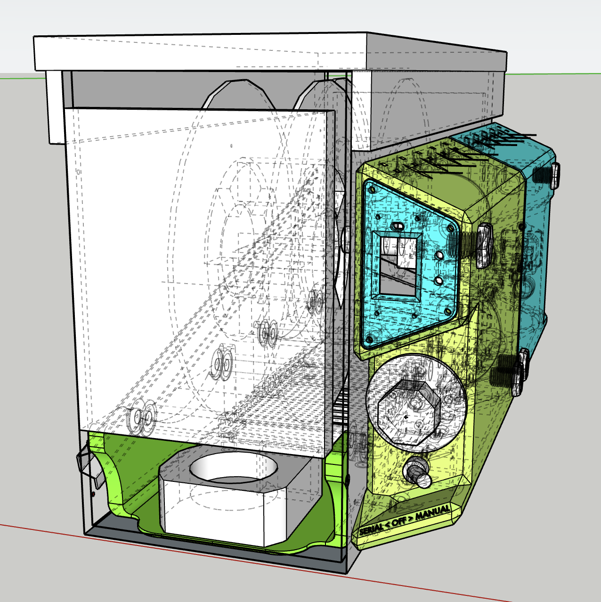

# Bulletproof: Filament Dehydrator/Drybox, prototype, the way I want it.

## Files included in this repo:

- *DONE* CircuitPython code which I'm running to [measure, display, and output precision Humidity/Temperature](./circuitpython_sht_featherboard)
- *DONE* [Bill of Materials](./BOM.md)
- TODO: Original 3d files (I used SketchUp, which is trivially import-able into Fusion360).
- TODO: STL files for all the printed parts, (labeled as internal or external)
- TODO: Ammo case specifications and drawings for the case I used.

---
## Why?
After burning through my *third* filament dryer, I got fed up with the natural layers of planned obsolescence baked into cheap products (and expensive products with cheap COTS parts).

I want my filament dryer to just work, no fuss, just do it's job so I can focus on other printing bits.

So, I built this relatively quickly.
*This is not a community/maintained project*, I'm just posting what I built to suit my own needs.  I do not plan to build more of this any time soon.  Depending on what parts are available to you, this exact build could prove prohibitively expensive.

# This is not an MMU/AMS type system, it's just a very beefy, and has features I want. 

I'm posting this as open source for inspiration, but if you build it exactly, well that's awesome! 
If this thing inspires your build, I'd love to hear about it!  <unixcardbide@blackhole.lol>

## In fact, I would strongly reccommend buyingi something instead of building this,

When I started making this prototype, I had no idea West3d was about to release something very robust, with radiant heat element, **very close to what I wanted**,
[West3D Filament Toaster - High Temperature Filament Dryer for all filament types](https://west3d.com/products/west3d-filament-toaster-high-temperature-filament-dryer-for-all-filament-types)
I may not have built mine if I knew about this nice build, yet, it does not have 3 things I want:
- Klipper telemetry/control
- Theirs has 24h cutoff switch 
- Theirs is not at all a drybox when it shuts off
- Precsion RH/Temp telemetry

---
## Features

- Dehydrates filament for most "common" filaments, (keep temps below boiling point).
- Feed directly into printer (like many products/designs).

- Full metal enclosure providing very good humidity protection when off.  (Remember, plastics are hygroscopic, plastic enclosures let humidity through.)

- Solenoid valves allow humidity-release/recirculation, valves close when heat/power is off, to prevent humidity from rushing back in.
  - PTFE tubes (and filament down their middle) is the only clear hygroscopic "leak" in the box, and relatively small.

- RH/Temp high precision monitor via Sensirion/SHT sensor, and hackable ESP32 display.

- Can operate in Manual or "Serial" modes,
  - Manual, simple as possible.
    - Independent RH/Temp Display
    - Toggle Switch Manual Mode ON/OFF, Dial Thermostat (set and forget when changing filament)
  - Serial, to Klipper/Kalico host machine,
    - Independent RH/Temp data output via serial (not klipperized firmware)
    - Provides low voltage relay connection for on/off, (wire to available Low-Voltage GPIO on your Klipperized printer mainboard).

- Radiant heat via Silicone Heater pad.
- Safety first, 3x temperature cut-off mechanisms:
  - Silicone Pad has internal temp cut-off (no controller necessary)
  - Extra 95C Temperature Switch Thermal Protector
  - Bulb style thermostat (main control knob), capped at 85C

## Un-Features

- This is *not* an Multi Material unit, nor suitable as-is for MMU use, (where a spool rewinding mechanism is important).
- This is a quickly implemented protototype.  If you like it, you may fare better to design your own, based on whatever you like about this one.
- This unit does *not* comunicate over IP networking or wifi, (but it could, if you decide to hack on the ESP32)

---
## Design Notes

What follows are notes on my various design choices, expressing intent:

- Use a simple, dual roller-bar design.  It's super common, and these designs have been most stable for me.

- Keep the hot parts mechanically governed:
  - I used a single 150w Silicone-Pad type heater, 110v, with an internal temperature regulator that runs around 195C.  These can operate as safely as incandescant light bulbs, but in a form factor more useful to this application.
  - I used a single adjustable 110v thermostat, which maxes out at 85C, designed for equipment which is intended to operate somewhere "below boiling point".
  - For double safety, (heat!), I added an extra "peak heat" safety thermostat, open circuit until 95C, (a thermostatic fuse would work as well here).

- A scrap Aluminum heat sink (ebay) is what the silicone pad heater is attached to, which is an ideal way to radiate the heat to the air inside the box.  However, just a sufficiently sized scrap of aluminum sheet would also radiate heat very well, as would other metals which have good conductive properties.  This is similar to any heated print-bed in a common 3d printer, which is your best source of chamber heat!

A note on PTC heaters, (I'm not using one here), I stay away from them in general.
My experiences with PTC heaters for 3d printing chamber air applications has not been great, I find they create several problems which are difficult or dangerous to overcome:
- PTC heaters immediately blow fast jets of very hot air, (by design), and I find it difficult/constraining to design things in a way where those jets don't create hot spots in the chamber, or on whatever they get pointed at.  Good PTC heater design requires large open spaces in the chamber being heated.
- For printer enclosures, PTC heaters move a lot of air quickly, which often creates other problems for the prints.
- For "uniform chamber air temp" applications, PTC heaters can consume more electricity than radiant methods, (depending on design).
- PTC heaters have numerous moving parts, (fans, heating elements, insulators) and are more prone to failure.
- Inexpensive PTC heaters are common, but these are very prone to failure, and PTC failure can easily create meltdowns or actual fire.

I want to be able to power off the enclosure but leave filament inside for days/weeks, so,
- Metal Enclosure, (used an Ammo can).  Plastic is hygroscopic.  The only "leaky" place in this design is the PTFE/Bowden tube where the filament exits the case, which, when filled with filament, is a very tiny opening for humidity to leak in.
- Solenoid valves for the "breather holes".  When heat is on, humidity needs a place to escape.  Most dryboxes have multiple holes high and low, to allow this.  When power is cut to the heat, metal solenoid valves close, preventing humidity from rushing back into the box.

I want to accurately measure the RH and temp in the filament chamber.  While RH measurements below 15% are nontrivial, the SHT series chips from Sensirion are basically the standard here.
https://sensirion.com/products/catalog/SHT45
Adafruit produces some easy to use (and Klipper friendly) i2c boards,
https://www.adafruit.com/product/5665

For this build, I'll be using an ESP32 based "Featherboard" with TFT display.
https://circuitpython.org/board/adafruit_feather_esp32s3_reverse_tft/
I'll be wiring up UART/Serial, so I can read the RH/Temp values from Klipper/Kalico based host machines (via actual serial, or USB-serial adapter).

And, if Klipper can read the RH/Temps, I certainly want the ability for Klipper to turn the heater on or off.  I *do not* need or want to control the temperature via Klipper, (that's simple enough to set on the dial according to the filament being loaded, when one is touching the box loading it).
I do however, want to be able to write macros that do things like: "if the RH of the filament chamber is above (N)%, pause before heat-soak/warmup/printing, turn on the filament chamber heat, and wait until the RH in the chamber has been below (x)% for (y)hrs before starting the print..." 
This may not be the design you want, but it's absolutely the design I want.

---
## Quirks

- To power the ESP32/featherboard, USBC is best, (5v).  I recycled an old Apple USB power supply to do this one job.  While re-cycling is great, and these units are built to safely withstand consumer abuse, you may want to do something more common to provide 5v USBC power.
- All hardware except the featherboard is 110v.  While this eliminates any need for a transformer, as tradeoff, some hardware is a bit clunky, weird, or uncommon. (e.g. the 110v fans and solenoids).
- VERY FEW printed parts are inside the heated chamber, (I printed internal parts using ASA), and none of these internal prints are mechanically stressed or structural.  Everything outside the chamber can be any filament you wish, (I used PLA+.)

